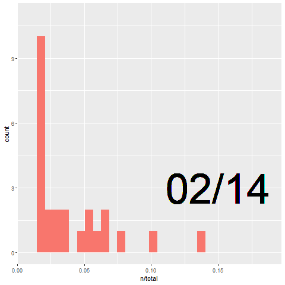
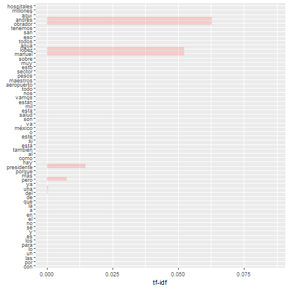

```{r global, include=FALSE}
library(ggplot2)
library(mgcv)
library(flexdashboard)
library(coronavirus)
library(rvest)
library(dplyr)
library(tidytext)
library(ggplot2)
library(gganimate)   
library(data.table)
library(tidyr)
library(topicmodels)
library(igraph)
library(ggraph)
library(stringr)
library(forcats)
library(shinyWidgets)
library(plotly)

data(coronavirus)

# set colors
confirmed_color <- "purple"
active_color <- "#1f77b4"
recovered_color <- "forestgreen"
death_color <- "red"

allscripts <- readRDS(file = "amlo_scripts_scraped.rds")

#remove first generic row
allscripts <- lapply(allscripts, function(i) i[-1,])

#STOP WORDS
custom_stop_words <- bind_rows(tibble(word = c('mil', 'andrés', 'manuel', 'lópez', 'obrador', 'presidente', 
                                               'si', 'entonces', 'pregunta', 'interlocutora', 'va', 'vamos', 
                                               'buenos', 'dias', 'méxico', NA)), 
                               tibble(word = tm::stopwords("spanish")))

transform_bind <- function(scripts, headn = 0){
  tidy_list <- list()
  for(i in names(scripts)) {
    tidy_list[[i]] <- scripts[[i]] %>%
      unnest_tokens(word, text) %>% anti_join(custom_stop_words)
  }
  
  count_list <- list()
  if(headn == 0){
    for(i in names(tidy_list)){
        count_list[[i]] <- tidy_list[[i]] %>% count(word, sort = TRUE)
     }
  } else {
    for(i in names(tidy_list)){
        count_list[[i]] <- tidy_list[[i]] %>% count(word, sort = TRUE) %>% head(headn)
     }
  }

  
  counted_dated <- list()
  for(i in names(count_list)){
    counted_dated[[i]] <- tibble(word = count_list[[i]]$word, n = count_list[[i]]$n, date = c(i))
  }
  
  return(counted_dated %>% bind_rows)
}

transform_bind_no_stop <- function(scripts){
  tidy_list <- list()
  for(i in names(scripts)) {
    tidy_list[[i]] <- scripts[[i]] %>%
      unnest_tokens(word, text)
  }
  
  count_list <- list()
  for(i in names(tidy_list)){
    count_list[[i]] <- tidy_list[[i]] %>% count(word, sort = TRUE) %>% head(25)
  }
  
  counted_dated <- list()
  for(i in names(count_list)){
    counted_dated[[i]] <- tibble(word = count_list[[i]]$word, n = count_list[[i]]$n, date = c(i))
  }
  
  return(counted_dated %>% bind_rows)
}


binded <- transform_bind(allscripts)
binded$datenumeric <- gsub('/', '', binded$date)
binded$date <- as.factor(binded$date)

bindedtop25 <- transform_bind(allscripts, 25)
bindedtop25$datenumeric <- gsub('/', '', bindedtop25$date)
bindedtop25$date <- as.factor(bindedtop25$date)

bindedtop25 %>%  
  # for each year we assign a rank
  group_by(datenumeric) %>%  
  arrange(datenumeric, -n) %>%  
  # assign ranking
  mutate(rank = row_number()) %>%  
  ungroup() ->  
  ranked_by_date

my_theme <- theme_classic(base_family = "") +
  theme(axis.text.y = element_blank()) +
  theme(axis.ticks.y = element_blank()) +
  theme(axis.line.y = element_blank()) +
  theme(legend.background = element_rect(fill = "gainsboro")) +
  theme(plot.background = element_rect(fill = "gainsboro")) +
  theme(panel.background = element_rect(fill = "gainsboro"))

df_daily <- coronavirus %>% 
  group_by(date, type) %>%
  filter(country == "Mexico" & date >= as.Date('2020-02-14') & date <= as.Date('2020-05-15')) %>%
  summarise(total = sum(cases, na.rm = TRUE)) %>%
  pivot_wider(names_from = type,
                     values_from = total) %>%
  arrange(date) %>%
  ungroup() %>%
  mutate(active =  confirmed - death - recovered) %>%
  mutate(confirmed_cum = cumsum(confirmed),
                death_cum = cumsum(death),
                recovered_cum = cumsum(recovered),
                active_cum = cumsum(active))

#bigram transformation
transform_bigrams <- function(){
  tidy_bigrams <- list()
  for(i in names(allscripts)) {
    tidy_bigrams[[i]] <- allscripts[[i]] %>%
      unnest_tokens(bigram, text, token = "ngrams", n = 2)
  }
  
  bigrams_stopped <- list()
  for(i in names(tidy_bigrams)){
    bigrams_stopped[[i]] <- tidy_bigrams[[i]] %>% separate(bigram, c("word1", "word2"), sep = " ") %>% 
      filter(!word1 %in% custom_stop_words$word,
             !word2 %in% custom_stop_words$word) %>% 
      count(word1, word2, sort = TRUE)
    
  }
  
  bigrams_dated <- list()
  for(i in names(bigrams_stopped)){
    bigrams_dated[[i]] <- tibble(word1 = bigrams_stopped[[i]]$word1, word2 = bigrams_stopped[[i]]$word2, n = bigrams_stopped[[i]]$n, date = c(i))
  }
  
  
  return(bigrams_dated)
}

#trigram transformation
transform_trigrams <- function(){
  tidy_bigrams <- list()
  for(i in names(allscripts)) {
    tidy_bigrams[[i]] <- allscripts[[i]] %>%
      unnest_tokens(trigram, text, token = "ngrams", n = 3)
  }
  
  trigrams_stopped <- list()
  for(i in names(tidy_bigrams)){
    trigrams_stopped[[i]] <- tidy_bigrams[[i]] %>% separate(trigram, c("word1", "word2", "word3"), sep = " ") %>% 
      filter(!word1 %in% custom_stop_words$word,
             !word2 %in% custom_stop_words$word,
             !word3 %in% custom_stop_words$word) %>% 
      count(word1, word2, word3, sort = TRUE)
    
  }
  
  trigrams_dated <- list()
  for(i in names(trigrams_stopped)){
    trigrams_dated[[i]] <- tibble(word1 = trigrams_stopped[[i]]$word1, word2 = trigrams_stopped[[i]]$word2,
                                  word3 = trigrams_stopped[[i]]$word3, n = trigrams_stopped[[i]]$n, date = c(i))
  }
  
  return(trigrams_dated)
}

bigrams <- transform_bigrams()
bigram_graph <- list()
for(i in names(bigrams)){
  bigram_graph[[i]] <- bigrams[[i]] %>% filter(n>2, 
                                               !str_detect(word1, "\\d"),
                                               !str_detect(word2, "\\d")) 
}

bigram_graph <- bigram_graph %>% bind_rows

trigrams <- transform_trigrams()

trigram_graph <- list()
for(i in names(bigrams)){
  trigram_graph[[i]] <- trigrams[[i]] %>% filter(n>2, 
                                               !str_detect(word1, "\\d"),
                                               !str_detect(word2, "\\d"),
                                               !str_detect(word3, "\\d")) 
}
trigram_graph <- trigram_graph %>% bind_rows

# supress non existent trigrams
tags$style(type="text/css",
  ".shiny-output-error { visibility: hidden; }",
  ".shiny-output-error:before { visibility: hidden; }"
)

#tf-idf  term frequency
binded_no_stop <- transform_bind_no_stop(allscripts)
binded_no_stop$datenumeric <- gsub('/', '', binded_no_stop$date)
binded_no_stop$datenumeric <- as.numeric(binded_no_stop$datenumeric)
binded_no_stop$date <- as.character(binded_no_stop$date)
binded_no_stop$datenumeric <- as.numeric(binded_no_stop$datenumeric)

total_words <- binded %>% 
  group_by(date) %>%
  summarize(total = sum(n))

script_words <- left_join(binded, total_words)

total_words_no_stop <- binded_no_stop %>% 
  group_by(date) %>%
  summarize(total = sum(n))

script_words_no_stop <- left_join(binded_no_stop, total_words_no_stop)

#zipfs law 
freq_by_rank <- script_words_no_stop %>% 
  group_by(datenumeric) %>% 
  mutate(rank = row_number(), 
         `term frequency` = n/total)


rank_subset <- freq_by_rank %>% 
  filter(rank < 500,
         rank > 10)

lm(log10(`term frequency`) ~ log10(rank), data = rank_subset)

dtm_one_words <- binded %>% cast_dtm(date, word, n)
ap_lda <- LDA(dtm_one_words, k = 3, control = list(seed = 152)) 
ap_topics <- tidy(ap_lda, matrix = "beta")

#General topic modelling of his scripts
top_terms <- ap_topics %>%
  group_by(topic) %>%
  top_n(10, beta) %>%
  ungroup() %>%
  arrange(topic, -beta)

#script by script topic modelling
chapters_gamma <- tidy(ap_lda, matrix = "gamma")
```

Exploration and hypothesis
=======================================================================

Row
---------------------------------------------------------------------

### Scripts scraped (from 02/14 until 05/15) {.value-box}

```{r}
# Emit the download rate
renderValueBox({
  valueBox(
    value = length(allscripts),
    icon = "fa-area-chart",
    #color = if (rate >= input$rateThreshold) "warning" else "primary"
  )
})
```

### Average range of vocabulary (distinct words) {.value-box}

```{r}
# dlCount is a reactive expression that keeps track of the total
# number of rows that have ever appeared through pkgStream.
# Emit the download count
renderValueBox({
  valueBox(round(nrow(binded) / length(allscripts)), icon = "fa-users")
})
```

### Mb (size of all scripts) stored as .rds  {.value-box}

```{r}
# usrCount is a reactive expression that keeps an approximate
# count of all of the unique users that have been seen since the
# app started.

# Emit the user count
renderValueBox({
  valueBox(value = 5.6, icon = "fa-download")
})
```

Hypothesis
------------------------------------------------------------------------

### Intro:

This dashboard contains the scripts of the speeches of the *conferencia matutina* (daily morning conference) starring the president of Mexico, Andres Manuel Lopez Obrador from February 14th, until May 15th of 2020. 

We will be showing distinct kind of shapes of data plotted in intuitive ways so it is easy for everyone to understand.

### Hypothesis:
There must be a change of vocabulary and key words usage if we compare his speeches before COVID-19 and after it. 

In the peaking days of the virus is going to be the only topic that will be covered. 

There must be a strong correlation between the stock market and his speeches.

### Preparation:
For this we are using the scripts scraped from [this website](https://lopezobrador.org.mx/transcripciones/).
The script is on the repo.

We will be attaching data of the virus that is available on [CRAN](https://cran.r-project.org/web/packages/coronavirus/).   
We will be check the date when the petrol dropped (4/20) to see if the speech contains it.

### Diamonds
------------------------------------------------------------------------

{#id .class width=1500px height=550px}

1 Grams tokens
=========================================================================

row {data-height=100}
----------------------------------------------------------------------

```{r}
sliderTextInput(
inputId = "sliderdate", 
label = "Choose a day",
grid = TRUE, 
width = 1500,
force_edges = TRUE,
choices = unique(as.character(bindedtop25$date))
)
br()
```

row {data-height=400}
----------------------------------------------------------------------

```{r, fig.height=300}
dataset <- reactive({
  dataset <- ranked_by_date %>% filter(as.character(date) == (input$sliderdate)) 
  dataset
})

renderPlot({
  p <- ggplot(dataset()) +  
  aes(xmin = 0 ,  
      xmax = n) +  
  aes(ymin = rank - .45,  
      ymax = rank + .45,  
      y = rank) +   
  scale_x_continuous(  
    limits = c(-140, 140),  
    breaks = c(0, 10, 30, 80)) +
  geom_rect(alpha = .7, size = 30) +
  scale_fill_viridis_d(option = "inferno",  
                       direction = -1) +  
  geom_text(col = "gray13",  
            hjust = "right",
            size = 8,
            aes(label = word),  
            x = -25) +  
  scale_y_reverse() +  
  labs(x = 'n') +  
  labs(y = "") +
  ggtitle("Most used words") +
  my_theme
  
  print(p)
}, )
```

row {data-height = 100, data-width = 1000}
----------------------------------------------------------------------

```{r}
coronadf <- reactive({
  coronadf <- df_daily %>% filter(date <= as.Date(paste0("2020/",as.character(input$sliderdate))) )
  coronadf
})

renderPlotly(
plotly::plot_ly(data = coronadf(),
                x = ~ date,
                y = ~ active_cum, 
                name = 'Active', 
                fillcolor = active_color,
                type = 'scatter',
                mode = 'none', 
                stackgroup = 'one') %>%
  plotly::add_trace(y = ~ recovered_cum,
                    name = "Recovered",
                    fillcolor = recovered_color) %>%
  plotly::add_trace(y = ~ death_cum,
                    name = "Death",
                    fillcolor = death_color) %>%
  plotly::layout(title = "",
                 yaxis = list(title = "Cumulative Number of Cases in Mexico"),
                 xaxis = list(title = "Date"),
                 legend = list(x = 0.1, y = 0.9),
                 hovermode = "compare")
)
```

row
---------------------------------------------------------------------

Here we can note how the most used words per day reflects by the cases that start to show. 
The first registered case appears in Mexico on February 28.


Bigrams & Trigrams
=========================================================================

aurio {data-height=100}
----------------------------------------------------------------------

```{r}
sliderTextInput(
inputId = "sliderdate2", 
label = "Choose a day",
grid = TRUE, 
width = 1500,
force_edges = TRUE,
choices = unique(as.character(bindedtop25$date))
)
br()
```

### aurio
----------------------------------------------------------------------

```{r}
bigram_graphdf <- reactive({
  bigram_graphdf <- bigram_graph %>% filter(as.character(date) == (input$sliderdate2)) 
  bigram_graphdf
})

set.seed(2016)
a <- grid::arrow(type = "closed", length = unit(.15, "inches"))
  
renderPlot(
  bigram_graphdf() %>%
    graph_from_data_frame() %>%
    ggraph(layout = "fr") +
    geom_edge_link(aes(edge_alpha = n), show.legend = FALSE, arrow = a) +
    geom_node_point(color = "lightblue", size = 5) +
    geom_node_text(aes(label = name), vjust = 1, hjust = 1) +
    theme_void()
)
```

### aurio
----------------------------------------------------------------------

```{r}
trigram_graphdf <- reactive({
  trigram_graphdf <- trigram_graph %>% filter(as.character(date) == input$sliderdate2)
  trigram_graphdf
})

set.seed(2016)
a <- grid::arrow(type = "closed", length = unit(.15, "inches"))
  
renderPlot(
    trigram_graphdf() %>%
    graph_from_data_frame() %>%
    ggraph(layout = "fr") +
    geom_edge_link(aes(edge_alpha = n), show.legend = FALSE, arrow = a) +
    geom_node_point(color = "lightblue", size = 5) +
    geom_node_text(aes(label = name), vjust = 1, hjust = 1) +
    theme_void()
)
```

As we can see, there's not many trigrams appearing, repetition is not a case in such speeches of AMLO.

TF - IDF
=========================================================================

row {data-height = 200}
----------------------------------------------------------------------
{ height=80% }

{ height=80% }

The statistic tf-idf is intended to measure how important a word is to a document in a collection of documents. In this case, all the scripts. The formula for inverse document frequency is defined as: idf(term) = ln(ndocuments / ndocuments containing term)

- On the left image, we can note the distribution of frequencies of words from the speeches for each of them. (without removing stop words). 
- On the right one you can check the actual words (plot is basically the same than the left but aggregates each day).
Both images are synced.

row {data-height=100}
----------------------------------------------------------------------

```{r}
renderPlotly(
freq_by_rank %>% 
  ggplot(aes(rank, `term frequency`, color = date)) + 
  geom_abline(intercept = -0.27, slope = -1.17, color = "gray50", linetype = 2) +
  geom_line(size = 1.1, alpha = 0.8, show.legend = FALSE) + 
  scale_x_log10() +
  scale_y_log10()
)
```

As Zipf's law states, the frequency that a word appears is inversely proportional to its rank.
Here we can note how the speeches throughout these months maintain a certain frequency, making them similar to each other.

On the higher ranks we can note how there's a normal use of *rare* words.
On the lower ranks we can note how the speeches include a bit more than the usual common words (comparing it to the linear fit).

Topic Modeling
=========================================================================

row {data-height=400, data-width = 400}
----------------------------------------------------------------------

```{r}
renderPlotly(
top_terms %>%
  mutate(term = reorder_within(term, beta, topic)) %>%
  ggplot(aes(term, beta, fill = factor(topic))) +
  geom_col(show.legend = FALSE) +
  facet_wrap(~ topic, scales = "free") +
  coord_flip() +
  scale_x_reordered()
)
```

row {data-height=100}
----------------------------------------------------------------------

```{r}
sliderTextInput(
inputId = "sliderdate3", 
label = "Choose a day",
grid = TRUE, 
width = 1500,
force_edges = TRUE,
choices = unique(as.character(chapters_gamma$document))
)

```

### row
----------------------------------------------------------------------

```{r}
chaptersdf <- reactive({
  chaptersdf <- chapters_gamma %>% filter(as.character(document) == input$sliderdate3) %>%
  mutate(title = reorder(document, gamma * topic))
  chaptersdf
})

renderPlotly(
chaptersdf() %>%
  ggplot(aes(factor(topic), gamma)) +
  geom_boxplot()
)
```

Using Latent Dirichlet allocation (LDA) for fitting a topic model into the script set, we chose the size of k = 3 to find what would be the 3 topics. 

- Came out to be pretty straight forward. As a mental exercise one could conceive what could be the topics that come for the words shown in the graph... Since they are generated in a pseudo-random order, topic number might change the actual topic it is addressing. 

- The idea is that we have 3 main ones.

Below there is a slider where you can explore which topics were covered by each script. Notice the trends and compare it to the coronavirus plot at the *1 Grams tokens* tab.

- One seems to be talking about the health of the people, cases, and hospitals. HEALTH.
- Another one seems to be talking about the government's addressing. LOGISTICS.
- The last one seems to be talking about the people and money and government. ECONOMY.

Conclusion
=======================================================================

Results of the former hypothesis.

- There must be a change of vocabulary and key words usage if we compare his speeches before COVID-19 and after it.
  - TRUE: you can note a pattern emerge from the 1 gram and bigram counts, the word frequency and topic modeling
- In the peaking days of the virus is going to be the only topic that will be covered.
  - *PARTIAL*: surprisingly (or not so much)... public health words and health topic are mentioned more frequently the higher the graph is, but then there are days after this that they try to focus the speech on something completely different.
- There must be a strong correlation between the stock market and his speeches.
  - FALSE: we checked the date of 4/20 to see if there is some mentioning of *petróleo* or *gasolina* and seems to not show much. This indicates the speeches are not following the stock markets (at all?).

row {data-width = 1000}
-----------------------------------------------------------------------

{ height=90%}

{ height=90%}

row {data-height = 100}
-----------------------------------------------------------------------

Feel free to use this dashboard as it pleases you. If you plan on contributing shoot a message, or find the contact on GitHub. Hope your findings reflect on your insights regarding Mexico.


