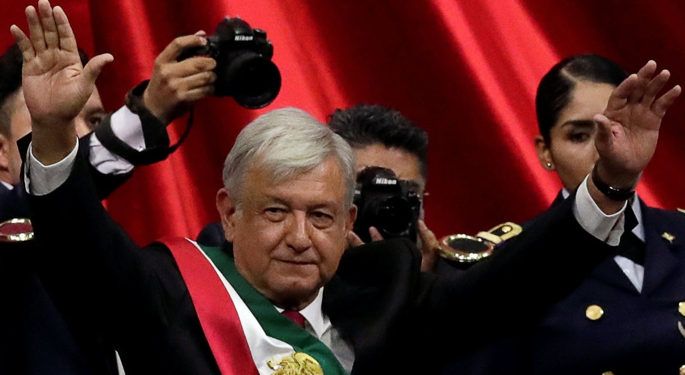

```{r global, include=FALSE}
library(ggplot2)
library(mgcv)
library(flexdashboard)
library(coronavirus)
library(rvest)
library(dplyr)
library(tidytext)
library(ggplot2)
library(gganimate)   
library(data.table)
library(tidyr)
library(topicmodels)
library(igraph)
library(ggraph)
library(stringr)
library(forcats)
library(shinyWidgets)

dataset <- diamonds


allscripts <- readRDS(file = "amlo_scripts_scraped.rds")

#remove first generic row
allscripts <- lapply(allscripts, function(i) i[-1,])

#STOP WORDS
custom_stop_words <- bind_rows(tibble(word = c('mil', 'andrés', 'manuel', 'lópez', 'obrador', 'presidente', 
                                               'si', 'entonces', 'pregunta', 'interlocutora', 'va', 'vamos', 'buenos', 'dias', NA)), 
                               tibble(word = tm::stopwords("spanish")))

transform_bind <- function(scripts, headn = 0){
  tidy_list <- list()
  for(i in names(scripts)) {
    tidy_list[[i]] <- scripts[[i]] %>%
      unnest_tokens(word, text) %>% anti_join(custom_stop_words)
  }
  
  count_list <- list()
  if(headn == 0){
    for(i in names(tidy_list)){
        count_list[[i]] <- tidy_list[[i]] %>% count(word, sort = TRUE)
     }
  } else {
    for(i in names(tidy_list)){
        count_list[[i]] <- tidy_list[[i]] %>% count(word, sort = TRUE) %>% head(headn)
     }
  }

  
  counted_dated <- list()
  for(i in names(count_list)){
    counted_dated[[i]] <- tibble(word = count_list[[i]]$word, n = count_list[[i]]$n, date = c(i))
  }
  
  return(counted_dated %>% bind_rows)
}

binded <- transform_bind(allscripts)
binded$datenumeric <- gsub('/', '', binded$date)
binded$date <- as.factor(binded$date)

bindedtop25 <- transform_bind(allscripts, 25)
bindedtop25$datenumeric <- gsub('/', '', bindedtop25$date)
bindedtop25$date <- as.factor(bindedtop25$date)

bindedtop25 %>%  
  # for each year we assign a rank
  group_by(datenumeric) %>%  
  arrange(datenumeric, -n) %>%  
  # assign ranking
  mutate(rank = row_number()) %>%  
  ungroup() ->  
  ranked_by_date

my_theme <- theme_classic(base_family = "") +
  theme(axis.text.y = element_blank()) +
  theme(axis.ticks.y = element_blank()) +
  theme(axis.line.y = element_blank()) +
  theme(legend.background = element_rect(fill = "gainsboro")) +
  theme(plot.background = element_rect(fill = "gainsboro")) +
  theme(panel.background = element_rect(fill = "gainsboro"))


```

Exploration and hypothesis
=======================================================================

Row
---------------------------------------------------------------------

### Scripts scraped (from 02/14 until 05/15) {.value-box}

```{r}
# Emit the download rate
renderValueBox({
  valueBox(
    value = length(allscripts),
    icon = "fa-area-chart",
    #color = if (rate >= input$rateThreshold) "warning" else "primary"
  )
})
```

### Average range of vocabulary (distinct words) {.value-box}

```{r}
# dlCount is a reactive expression that keeps track of the total
# number of rows that have ever appeared through pkgStream.
# Emit the download count
renderValueBox({
  valueBox(round(nrow(binded) / length(allscripts)), icon = "fa-download")
})
```

### Mb (size of all scripts) stored as .rds  {.value-box}

```{r}
# usrCount is a reactive expression that keeps an approximate
# count of all of the unique users that have been seen since the
# app started.

# Emit the user count
renderValueBox({
  valueBox(value = 5.6, icon = "fa-users")
})
```

Hypothesis
------------------------------------------------------------------------

### Intro:

This dashboard contains the scripts of the speeches of the *conferencia matutina* (daily morning conference) starring the president of Mexico, Andres Manuel Lopez Obrador from February 14th, until May 15th of 2020. 

We will be showing distinct kind of shapes of data plotted in intuitive ways so it is easier for everyone to understand.

### Hypothesis:
There must be a change of vocabulary and key words usage if we compare his speeches before COVID-19 and after it. 

In the peaking days of the virus is going to be the only topic that will be covered. 

There must be a strong correlation between the stock market and his speeches.

### Preparation:
For this we are using the scripts scraped from [this website](https://lopezobrador.org.mx/transcripciones/).
The script is on the repo.

We will be attaching data of the virus that is available on [CRAN](https://cran.r-project.org/web/packages/coronavirus/).   
We will be mentioning the date when the petrol dropped to see if the speech contains it

### Diamonds
------------------------------------------------------------------------

{#id .class width=1000px height=350px}

1 Grams tokens
=========================================================================

row {data-height=50}
----------------------------------------------------------------------
```{r}
materialSwitch(inputId = "id", label = "Day by day / all speeches", status = "danger")
```

aurio {data-height=50}
----------------------------------------------------------------------

```{r}
sliderTextInput(
inputId = "sliderdate", 
label = "Choose day:",
grid = TRUE, 
width = 1000,
force_edges = TRUE,
choices = unique(as.character(bindedtop25$date))
)
br()
```

o maurio {data-height=400}
----------------------------------------------------------------------

```{r, fig.height=400}
dataset <- reactive({
  dataset <- ranked_by_date %>% filter(as.character(date) == (input$sliderdate)) 
  dataset
})

renderPlot({
  p <- ggplot(dataset()) +  
  aes(xmin = 0 ,  
      xmax = n) +  
  aes(ymin = rank - .45,  
      ymax = rank + .45,  
      y = rank) +   
  scale_x_continuous(  
    limits = c(-140, 140),  
    breaks = c(0, 10, 30, 80)) +
  geom_rect(alpha = .7, size = 30) +
  scale_fill_viridis_d(option = "magma",  
                       direction = -1) +  
  geom_text(col = "gray13",  
            hjust = "right",
            size = 8,
            aes(label = word),  
            x = -25) +  
  scale_y_reverse() +  
  labs(x = 'n') +  
  labs(y = "") +
  ggtitle("Most used words") +
  my_theme
  
  print(p)
}, )
```

Bigrams & Trigrams
=========================================================================

Inputs {.sidebar}
-----------------------------------------------------------------------

```{r}
sliderInput('sampleSize', 'Sample Size', min=1, max=nrow(dataset),
            value=min(1000, nrow(dataset)), step=500, round=0)

checkboxInput('jitter', 'Jitter', value = TRUE)
checkboxInput('smooth', 'Smooth', value = TRUE)

selectInput('x', 'X', names(dataset))
selectInput('y', 'Y', names(dataset), names(dataset)[[2]])
selectInput('color', 'Color', c('None', names(dataset)))

selectInput('facet_row', 'Facet Row',
            c(None='.', names(diamonds[sapply(diamonds, is.factor)])))
selectInput('facet_col', 'Facet Column',
            c(None='.', names(diamonds[sapply(diamonds, is.factor)])))
```

### aurio
----------------------------------------------------------------------

```{r}


```

TF - IDF
=========================================================================

Inputs {.sidebar}
-----------------------------------------------------------------------

```{r}

```

### aurio
----------------------------------------------------------------------

```{r}

```

Topic Modelling
=========================================================================

Inputs {.sidebar}
-----------------------------------------------------------------------

```{r}

```

### aurio
----------------------------------------------------------------------

```{r}

```